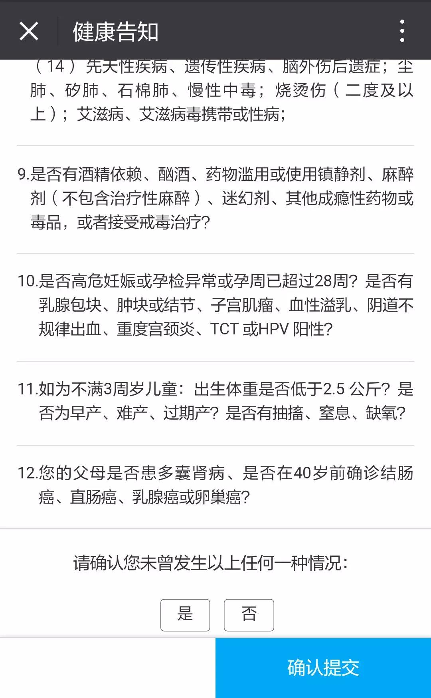

知识点｜如实告知的两个原则
原创 2018-01-08 腰闪了的关哥 关哥说险
腰扭了忍痛录的，中气明显不足
来自关哥说险
00:0008:59

今天是语音，腰扭了坐不住，岁数大了。

截了哆啦A保的如实告知内容给大家参考。

<!--  -->

因为是多次赔付，所以询问相对比较细，有些险种相对就简单很多了。

总结如实告知两个原则：

1、诚信原则。

不要小瞧保险公司的调查能力，调查过程跟破案似的，跟公安机关有的一拼。特别是在医院有就诊记录的，就别抱太大的侥幸心理了。

有一点，录音的时候忘记说，自己不知道自己得病了，没有去医院进行过诊断，投保之后才发现病情。这个不算未如实告知。

2、询问告知。

有些可治愈的或可逆的健康问题，时间长了其实对以后的发病率没有影响。比如割个阑尾，比如摔骨折了，这种往往不需要如实告知。包括一些体检的异常，如果好了，最近几年体检报告中没有，也不再告知的范围内。

特殊情况太多，没法列举，还是那句话，仔细看告知内容就好。

保险公司是不会闲的无聊去想方设法不赔付的，监管严着呢。如果真的是不哦赔付，要么是不够赔付标准，要么是有特殊情况。这种情况，我说过，除非自己心里有数自己是有问题的，否则该争取还是要争取的。总有些灰色地带。

最后还是感慨一下，很多人排斥保险，等真的明白过来想买了，才发现年龄、健康都过了黄金投保期，要么贵，要么想买都买不上。

虽然不现实，就祝福所有人一辈子尽量健康吧。